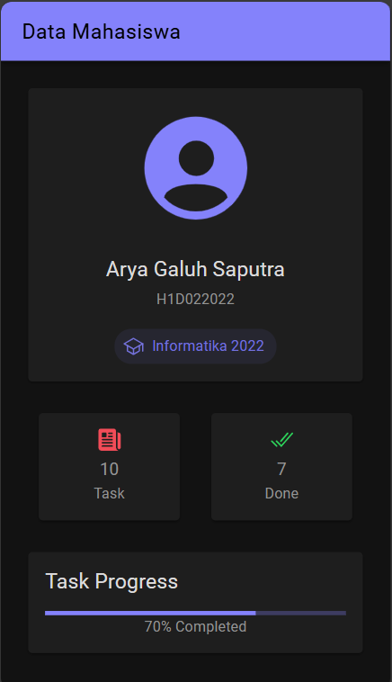

- **Nama** : Arya Galuh Saputra
- **NIM** : H1D022022
- **Shift Lama** : C
- **Shift Baru** : B

# Tugas 6 - Pertemuan 7

## Screenshot Aplikasi


## Cara Menambahkan Komponen di Ionic

### 1. Membuat Komponen Baru

```bash
ionic generate component nama-komponen
```
### 2. Menggunakan Komponen Ionic
Untuk menggunakan komponen bawaan Ionic, tambahkan tag komponen ke file HTML:

1. Buka project Ionic.
2. Pilih halaman untuk tempat menambahkan komponen, misalnya di home.page.html.
3. Untuk melihat daftar komponen, buka dokumentasi Ionic di https://ionicframework.com/docs/components 
4. Pilih komponen yang akan digunakan, sebagai contoh ion-card.

```html
<ion-card>
  <ion-card-header>
    <ion-card-title>Judul Card</ion-card-title>
  </ion-card-header>
  <ion-card-content>
    Isi konten card
  </ion-card-content>
</ion-card>
```

5. Copy kode komponen dan paste di file .html yang tadi dipilih.
6. Tambahkan CSS styling di file .scss jika ingin mengubah tampilan komponen.

```scss
#container strong {
  font-size: 20px;
  line-height: 26px;
}
```

7. Jalankan project Ionic dengan perintah ionic serve atau ionic s untuk melihat hasilnya di browser.